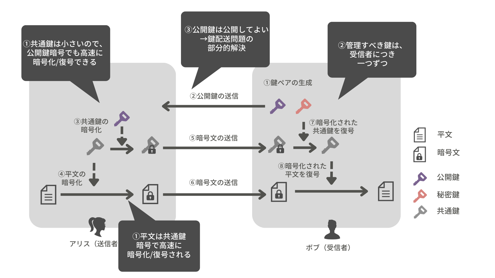

# ハイブリッド暗号
## 背景：共通鍵暗号と公開鍵暗号の限界

共通鍵暗号方式と公開鍵暗号方式では、
「処理速度」、「管理すべき鍵の数」、「鍵配送問題の有無」の間で、
トレードオフが発生している。

|  | 共通鍵暗号 | 公開鍵暗号 |
|:-:|:-:|:-:|
| 処理速度 | 速い | 遅い |
| 管理する鍵の数 | 多い | 少ない |
| 鍵配送問題 | 解決されない | 部分的に解決されている |

**理想的には、「処理速度が速く」、「管理すべき鍵の数が少なく」、「鍵配送問題を部分的に解決した」暗号方式がほしい。**

## ハイブリッド暗号

ハイブリッド暗号とは、共通鍵暗号方式と公開鍵暗号方式のいいとこ取りをした暗号方式である。  
ハイブリッド暗号は、「処理速度が速く」、「管理すべき鍵の数が少なく」、「鍵配送問題を部分的に解決した」。

ハイブリッド暗号は、次のように共通鍵暗号と公開鍵暗号を組み合わせる。

1. 共通鍵を公開鍵暗号で暗号化して配送
  ※共通鍵は小さいため、公開鍵でも高速に暗号化/復号できる
1. 平文を共通鍵暗号方式で暗号化して配送

