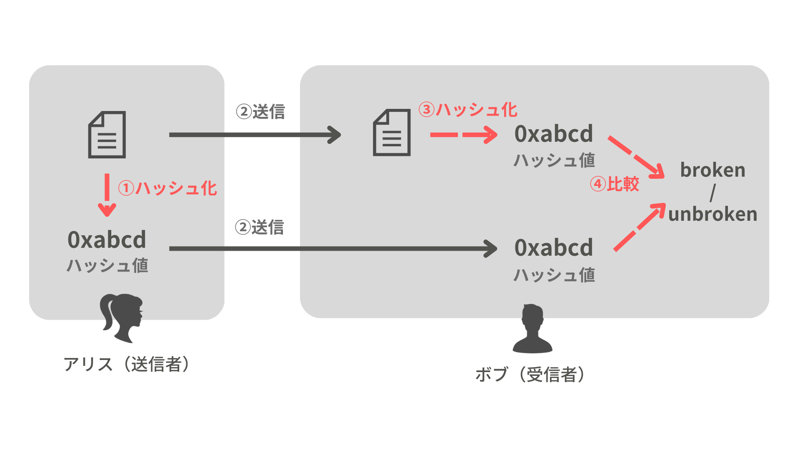

# 暗号学的ハッシュ関数

暗号学的ハッシュ（要約）関数とは、任意の大きさの情報を、一定サイズの情報に変換する関数である。  
  暗号学的ハッシュ関数により、より短いビット長の比較で、大きな情報の一致/不一致を確認できる。  
   このような一致の確認は、ファイルの改ざんや破損の確認に用いられる。

暗号学的ハッシュ関数による変換を **ハッシュ化** と呼び、
出力された一定サイズの情報を **ハッシュ値** と呼ぶ。

なお一般的に `SHA-256`と呼ばれるハッシュ関数が有名である。
  
{: .warning }
> MD5やSHA1といった暗号学的ハッシュ関数も有名であるが、安全性のために使うべきでない。

## 暗号学的ハッシュ関数の性質

- ハッシュ化する前の値が変われば、ハッシュ化したときのハッシュ値は大きく変わる。
- ハッシュ化は高速にできる
- 以下のセキュリティ上の性質を満たす
    - ハッシュ値から元（≒ハッシュ化前）の情報を得ることができない。（**原像計算困難性**）
      - $h = Hash(m)$ となるとき、 $h$ から $m$ を求められない。
    - ハッシュ化したときに、特定のハッシュ値になる別の情報を見つけられない。（**第2原像計算困難性**）
      - $h = Hash(m_1) = Hash(m_2)$ のとき、 $Hash(m_1)$ から $m_2$ を求められない。
    - 「ハッシュ化したときに同じハッシュ値となる」異なる情報のペアを見つけられない。（**強衝突耐性**）
      - $Hash(a) = Hash(b)$ となる $a, b$ のペアを見つけられない。

## 暗号学的ハッシュ関数の応用例

- ファイル破損の検知
  - ダウンロードしたファイルのハッシュ値と、ダウンロード元が公開するハッシュ値を比較して、ファイルが壊れていないか確認できる。
    - 大きなファイル（例：OSのイメージ）のダウンロード時に有効である。
- 署名対象の要約
  - ディジタル署名方式において、署名対象を小さくする（つまりは要約する）ことで、署名・検証にかかる時間を短くする。
- パスワードの比較
  - 生のパスワードを（長期）保存せずに、パスワードの検証をできるようにする。
  - 登録時にハッシュ化した値のみを保存しておき、認証時に受け取ったパスワードのハッシュ値と比較する。
    - 保存したハッシュ値が漏洩しても、元のパスワードを推測できないため、安全である。
- ブロックチェーンのマイニング
  - TODO
